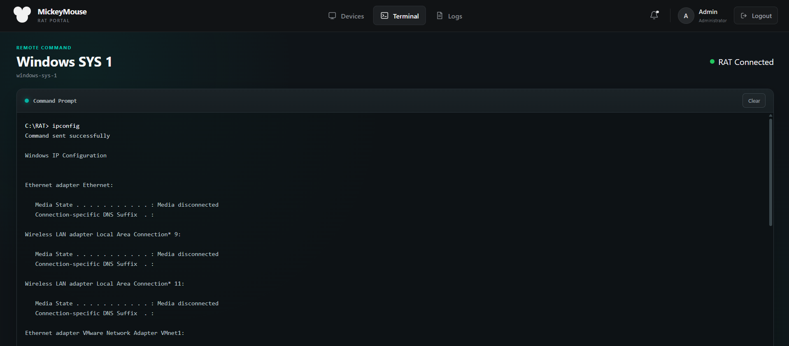
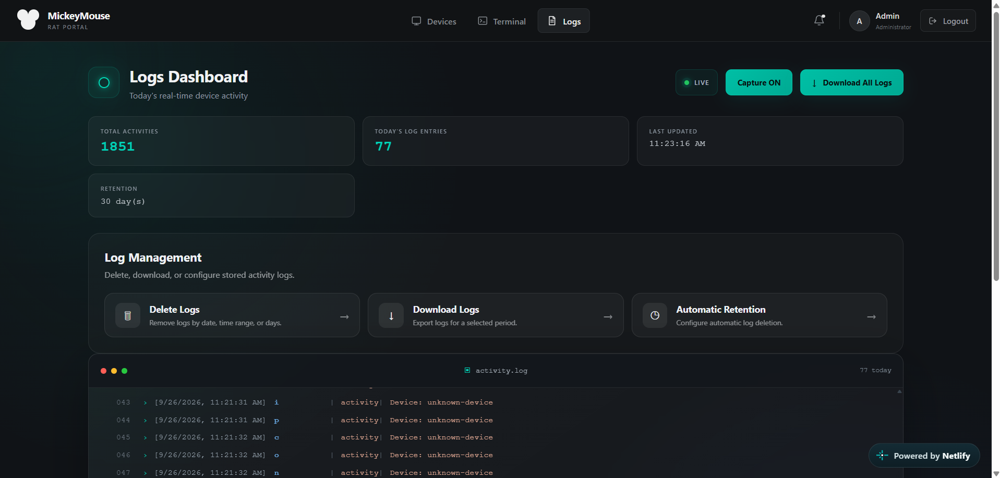

# 🐭 MickeyMouse

## 📝 About

**MickeyMouse** is a **cybersecurity research and remote monitoring project** designed for authorized security testing and controlled lab environments. It provides a web-based interface for monitoring system activity, executing authorized commands, and viewing security events in real time.

The project focuses on **client-server communication, WebSockets, command execution, keystroke logging, activity monitoring, and security event management**.

> ⚠️ This project should only be used on systems you own or have explicit authorization to monitor.

---

## 🌐 Live Demo

Try the **MickeyMouse** dashboard:

🚀 **[Open Live Project](https://mickeymouse1.netlify.app/)**

---

## 📦 Client Application

The Windows **`.exe` client application is not included in this GitHub repository**.

For authorized testing, request the latest `.exe` build 😁.


---

## 🖼️ Project Overview

### 💻 Command Terminal



### 📊 Activity Logs



---

## 🚀 Features

* **Command Execution**: Execute authorized commands through the security dashboard.
* **Key Logging**: Capture and display keyboard activity for controlled security testing.
* **Real-Time Logs**: View captured activity through a live terminal interface.
* **Activity Monitoring**: Monitor system events and activity in real time.
* **WebSocket Communication**: Real-time communication between the client and dashboard.
* **Log Management**: View, clear, and download security logs.
* **Dashboard Interface**: Modern interface for security monitoring.
* **REST API**: Backend APIs for monitoring and log management.

---

## 🛠️ Technologies Used

* **Frontend**: React.js, Vite, CSS
* **Backend**: Node.js, Express.js
* **Real-Time Communication**: WebSocket
* **Database**: MongoDB, Mongoose
* **Client**: Windows `.exe`
* **Deployment**: Netlify, Render
* **Tools**: Git, GitHub, Postman

---

## 💻 Installation

### Clone the repository

```bash
git clone https://github.com/yourusername/mickymouse.git
```

### Install dependencies

```bash
cd frontend
npm install
```

```bash
cd backend
npm install
```

### Run the project

```bash
npm run dev
```

> Configure the required environment variables before running the application.

> ⚠️ **Ethical Use:** Command execution and keystroke logging must only be used on systems where you have explicit authorization.
